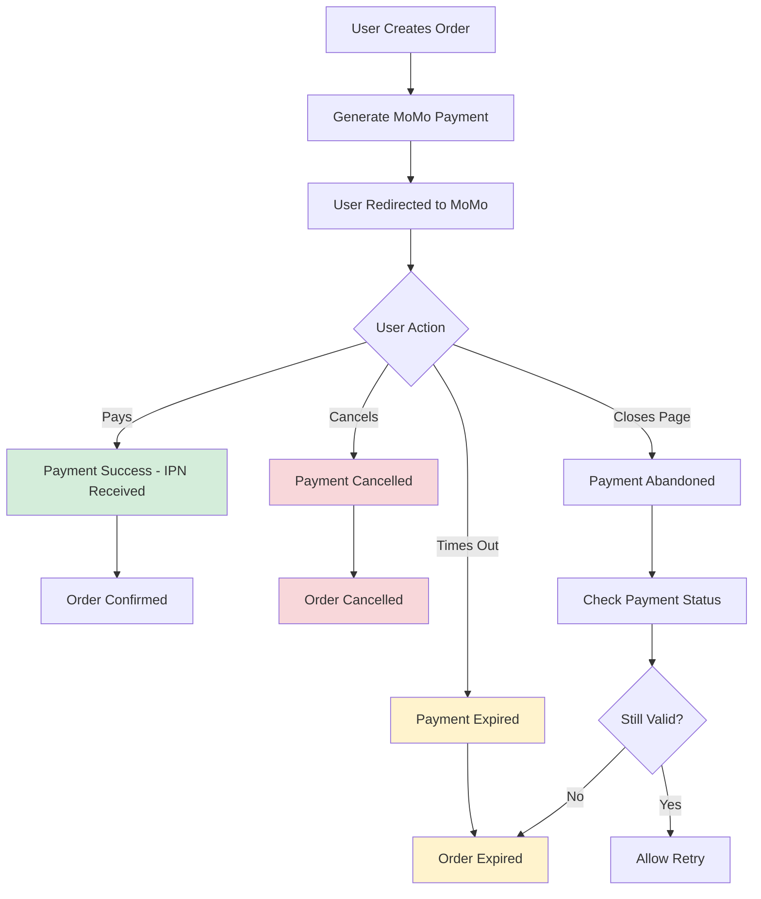

# MoMo Payment Expiration Handling Guide

## Overview

This guide explains how to handle payment expiration scenarios in the MoMo payment integration. MoMo payments typically expire after 15 minutes, and proper handling ensures good user experience and accurate order management.

## 🕐 Payment Expiration Scenarios

### 1. Time-Based Expiration

- **Duration**: 15 minutes from payment creation
- **Trigger**: Automatic timeout
- **Result Code**: 1005 (URL or QR code expired)
- **Status**: `expired`

### 2. User Abandonment

- **Trigger**: User closes payment page without completing
- **Result Code**: 1006 (User declined payment)
- **Status**: `cancelled`

### 3. System Timeout

- **Trigger**: Network issues or system errors
- **Result Code**: 99 (Unknown error)
- **Status**: `system_error`

### 4. Manual Cancellation

- **Trigger**: User or admin cancels payment
- **Result Code**: 1003 (Transaction cancelled)
- **Status**: `cancelled`

## 📊 MoMo Result Codes for Expiration/Cancellation

| Result Code | Description           | Status      | Type           |
| ----------- | --------------------- | ----------- | -------------- |
| 1005        | URL/QR code expired   | `expired`   | Time-based     |
| 1006        | User declined payment | `cancelled` | User action    |
| 1003        | Transaction cancelled | `cancelled` | System/User    |
| 1017        | Cancelled by partner  | `cancelled` | Partner action |

## 🔧 Implementation

### 1. Automatic Expiration Check

```javascript
// Check for expired payments (run periodically)
const result = await MomoPaymentService.checkExpiredPayments(15); // 15 minutes
console.log(`Processed ${result.expiredCount} expired payments`);
```

### 2. Manual Payment Cancellation

```javascript
// Cancel a specific payment
const result = await MomoPaymentService.cancelPayment(
    orderId,
    'User requested cancellation',
);
```

### 3. Check Payment Timeout Status

```javascript
// Get current timeout status for a payment
const status = await MomoPaymentService.getPaymentTimeoutStatus(orderId);
console.log(`Payment expires in ${status.remainingMinutes} minutes`);
```

## 🌐 API Endpoints

### 1. Get Payment Expiration Status

```http
GET /v1/api/momo/expiration/{orderId}
Authorization: Bearer <token>
```

**Response:**

```json
{
    "status": 200,
    "message": "Lấy trạng thái hết hạn thanh toán thành công",
    "metadata": {
        "orderId": "123",
        "status": "pending",
        "createdAt": "2025-07-13T12:00:00.000Z",
        "minutesElapsed": 8,
        "timeoutMinutes": 15,
        "isExpired": false,
        "remainingMinutes": 7,
        "remainingSeconds": 420
    }
}
```

### 2. Cancel Payment

```http
POST /v1/api/momo/cancel/{orderId}
Authorization: Bearer <token>
Content-Type: application/json

{
    "reason": "User requested cancellation"
}
```

**Response:**

```json
{
    "status": 200,
    "message": "Hủy thanh toán thành công",
    "metadata": {
        "success": true,
        "message": "Payment cancelled successfully"
    }
}
```

### 3. Check Expired Payments (Admin)

```http
POST /v1/api/momo/check-expired
Authorization: Bearer <token>
```

**Response:**

```json
{
    "status": 200,
    "message": "Kiểm tra thanh toán hết hạn thành công",
    "metadata": {
        "success": true,
        "expiredCount": 5,
        "message": "Updated 5 expired payments"
    }
}
```

## 🔄 Payment Flow with Expiration Handling



## 📱 Frontend Integration

### 1. Payment Timeout Countdown

```javascript
// Display countdown timer for payment expiration
const startPaymentCountdown = async (orderId) => {
    const checkStatus = async () => {
        try {
            const response = await fetch(`/v1/api/momo/expiration/${orderId}`, {
                headers: { Authorization: `Bearer ${token}` },
            });
            const data = await response.json();

            if (data.metadata.isExpired) {
                showPaymentExpiredMessage();
                return false; // Stop countdown
            }

            updateCountdownDisplay(
                data.metadata.remainingMinutes,
                data.metadata.remainingSeconds,
            );
            return true; // Continue countdown
        } catch (error) {
            console.error('Error checking payment status:', error);
            return false;
        }
    };

    // Check every 30 seconds
    const interval = setInterval(async () => {
        const shouldContinue = await checkStatus();
        if (!shouldContinue) {
            clearInterval(interval);
        }
    }, 30000);

    // Initial check
    checkStatus();
};
```

### 2. Handle Payment Cancellation

```javascript
const cancelPayment = async (orderId, reason = 'User cancelled') => {
    try {
        const response = await fetch(`/v1/api/momo/cancel/${orderId}`, {
            method: 'POST',
            headers: {
                'Content-Type': 'application/json',
                Authorization: `Bearer ${token}`,
            },
            body: JSON.stringify({ reason }),
        });

        const result = await response.json();

        if (result.status === 200) {
            showCancellationSuccess();
            redirectToOrderHistory();
        }
    } catch (error) {
        console.error('Error cancelling payment:', error);
        showCancellationError();
    }
};
```

### 3. Payment Status Polling

```javascript
const pollPaymentStatus = async (orderId, maxAttempts = 30) => {
    for (let attempt = 0; attempt < maxAttempts; attempt++) {
        try {
            const response = await fetch(`/v1/api/momo/status/${orderId}`);
            const data = await response.json();

            const status = data.metadata.status;

            if (status === 'completed') {
                showPaymentSuccess();
                redirectToOrderConfirmation(orderId);
                return;
            }

            if (['failed', 'cancelled', 'expired'].includes(status)) {
                showPaymentFailure(status);
                return;
            }

            // Wait 2 seconds before next check
            await new Promise((resolve) => setTimeout(resolve, 2000));
        } catch (error) {
            console.error('Error polling payment status:', error);
        }
    }

    // Max attempts reached
    showPaymentTimeout();
};
```

## ⚙️ Scheduled Tasks

### 1. Cron Job for Expired Payments

```javascript
// Add to your cron job scheduler
const cron = require('node-cron');
const MomoPaymentService = require('./src/services/payment/momo.service');

// Run every 5 minutes
cron.schedule('*/5 * * * *', async () => {
    try {
        const result = await MomoPaymentService.checkExpiredPayments();
        console.log(`Expired payments check: ${result.message}`);
    } catch (error) {
        console.error('Error in expired payments cron job:', error);
    }
});
```

### 2. Database Cleanup

```javascript
// Clean up old expired payments (run daily)
cron.schedule('0 2 * * *', async () => {
    try {
        // Archive payments older than 30 days
        const thirtyDaysAgo = new Date(Date.now() - 30 * 24 * 60 * 60 * 1000);

        await database.Payment.update(
            { archived: true },
            {
                where: {
                    status: ['expired', 'cancelled', 'failed'],
                    created_at: { [database.Sequelize.Op.lt]: thirtyDaysAgo },
                },
            },
        );

        console.log('Payment cleanup completed');
    } catch (error) {
        console.error('Error in payment cleanup:', error);
    }
});
```

## 🎯 Best Practices

### 1. User Experience

- **Clear Communication**: Always inform users about payment timeout
- **Countdown Timer**: Show remaining time for payment
- **Easy Retry**: Allow users to retry expired payments
- **Cancel Option**: Provide clear cancellation option

### 2. System Design

- **Automatic Cleanup**: Regular cleanup of expired payments
- **Status Tracking**: Comprehensive status tracking
- **Error Handling**: Graceful error handling for all scenarios
- **Logging**: Detailed logging for debugging

### 3. Performance

- **Efficient Queries**: Use indexed queries for status checks
- **Background Processing**: Handle expiration checks in background
- **Caching**: Cache payment status for frequently checked orders
- **Rate Limiting**: Limit API calls to prevent abuse

## 🚨 Error Scenarios

### 1. Payment Already Processed

```javascript
// When trying to cancel/expire a completed payment
{
    "error": "Payment not found or already processed",
    "code": "PAYMENT_ALREADY_PROCESSED"
}
```

### 2. Order Not Found

```javascript
// When order doesn't exist
{
    "error": "Payment not found",
    "code": "PAYMENT_NOT_FOUND"
}
```

### 3. System Error

```javascript
// When database or system error occurs
{
    "error": "Failed to cancel payment",
    "code": "SYSTEM_ERROR"
}
```

## 📊 Monitoring and Analytics

### 1. Payment Expiration Metrics

- Track expiration rates by time of day
- Monitor user abandonment patterns
- Analyze payment success vs. expiration ratios

### 2. Performance Monitoring

- Monitor API response times for status checks
- Track database query performance
- Monitor background job execution times

### 3. Alerting

- Alert on high expiration rates
- Alert on system errors during expiration handling
- Alert on failed background job executions

## 🔍 Debugging

### 1. Check Payment Status

```bash
# Check specific payment status
curl -X GET "http://localhost:3055/v1/api/momo/status/123" \
  -H "Authorization: Bearer <token>"
```

### 2. Force Expiration Check

```bash
# Manually trigger expiration check
curl -X POST "http://localhost:3055/v1/api/momo/check-expired" \
  -H "Authorization: Bearer <token>"
```

### 3. Cancel Payment

```bash
# Cancel specific payment
curl -X POST "http://localhost:3055/v1/api/momo/cancel/123" \
  -H "Content-Type: application/json" \
  -H "Authorization: Bearer <token>" \
  -d '{"reason": "Testing cancellation"}'
```

This comprehensive guide covers all aspects of handling payment expiration in your MoMo integration, ensuring robust payment processing and excellent user experience.
